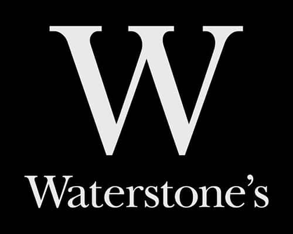
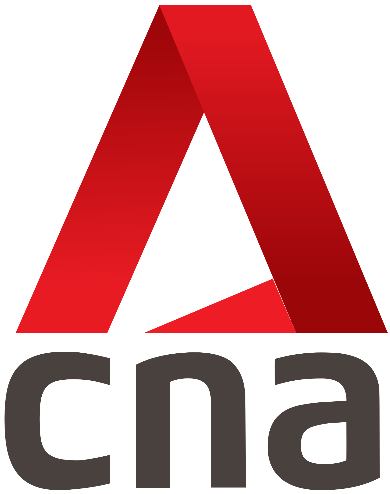
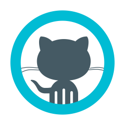

# Portfolio :handbag:

Amir Ali Jiwani

---

**[Link](https://www.waterstones.com/)** to the web

---

> `A favourite chain of book stores for all of the UK, holding more than 300 physical stores in various parts of the UK.`

We created the web application, along with their mobile fronts, where we enabled users to view their listing of the favourite books and purchase them on the go. The product allowed individuals to create profiles to create bookmarks, favourites and other beautiful things.

---

<!-- backgroundColor: #ffd9fe -->

**[Link](https://www.missselfridge.top/)** to the web

---

<!-- backgroundColor: white -->

> `Miss Selfridge was a British high street store chain which began as the young fashion section of Selfridges department store in London in 1966.`

We created the web and mobile experiences for the customers; To let them browse through their favourite store online. We added the ability to enable purchases via online payments and other cool features.

---
	

**[Link](https://www.channelnewsasia.com/international)** to the web

---
	
> `CNA is an English-language news channel based in Singapore. It broadcasts free-to-air domestically and as a subscription network to 29 territories across Asia and Australia.`

We created the web as well as Windows 8 early experience for the client; This enabled them to take their application live along side the first release of the Windows 8 in Singapore region.

---

**[Link](https://www.straitstimes.com/global)** to the web

---

> `The Straits Times is an English-language daily broadsheet newspaper based in Singapore and currently owned by Singapore Press Holdings. The Sunday Times is its Sunday edition. The newspaper was established on 15 July 1845 as The Straits Times and Singapore Journal of Commerce.`

We created the web as well as Windows 8 early experience for the client; This enabled them to take their application live along side the first release of the Windows 8 in Singapore region.

---

# SEEK

**[Link](https://www.seek.com.au/)** to the web

---

> `Seek Limited is an Australian human resource consulting company. It is headquartered in Melbourne, Australia, and operates in 18 countries. It is a publicly traded company listed on the Australian Securities `

Created the web experience for *Hirers* and *Candidates*, there were multiple products that all synchronize together to form the experience you see over the web site.

---

**[Link](https://www.exact.com/)** to the web

---

> `Exact is a Dutch software company that offers accounting, ERP, and other software for small and medium enterprises. Exact develops cloud-based and on-premises software for industries such as accountancy, wholesale distribution, professional services and manufacturing, serving more than 500,000 companies.`

---

**[Link](https://www.albaloo.com/)** to the web

---

> `Albaloo is a fast growing location based advertising platform, consists of Mobile App, Web Portal, Social Media Fan Pages and 3rd Party Advertising Partners.`

Created the whole web experience, along side mobile apis and their UX.

---

**[Link](http://scottwb.com/projects/post-on-the-wall/)** to the owners blog

---

`Post On The Wall™ was a desktop web app and native iOS app that provided “virtual walls” at geographic locations, enabling users within a close range to upload pictures, sketches, and other content from their mobile devices, that were projected to a big screen with a real-time, animated view of the wall as it’s content unfolded.`

---

<!-- backgroundColor: black -->
<!-- color: white -->

# Myself

[@aajiwani](https://github.com/aajiwani)